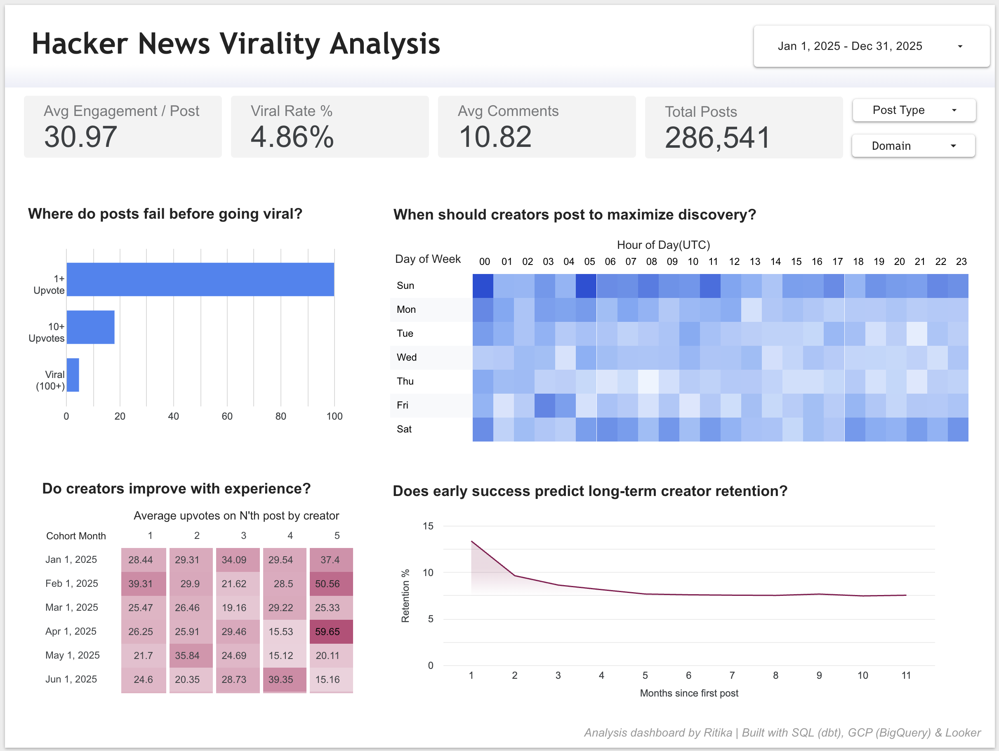

# Hacker News Virality Analysis 🚀

### An end-to-end ELT pipeline and dashboard analyzing 280k+ posts to determine the factors of virality and user retention.

[](https://lookerstudio.google.com/s/s8KTCuzThzA)

## 📊 Project Overview
This project analyzes **286,000+ Hacker News posts** from 2025 to uncover what makes content go viral and how creator retention evolves over time.

Using the modern data stack (**dbt, BigQuery, Looker**), I built a pipeline that transforms raw public data into a star-schema data mart, enabling analysis of:
* **The Viral Funnel:** Identifying the exact drop-off points from creation to "Front Page" status.
* **Creator Lifecycle:** Measuring cohort-based retention to see if successful authors stick around.
* **Optimal Posting Windows:** Heatmap analysis of day-of-week and hour-of-day performance.

## 💡 Key Insights
* **The "Viral" Threshold:** Only **4.86%** of posts achieve "Viral" status (>100 upvotes).
* **The "First Hurdle" Matters:** Posts that receive at least **2 upvotes** (external validation) are 5x more likely to reach the front page than those that stay at 1.
* **Retention Decay:** Creator retention follows a steep decay curve, stabilizing at **~8%** after the 3rd month. Focus on "activation" in the first 60 days is critical.

## 🛠️ Tech Stack & Architecture
* **Data Warehouse:** Google BigQuery
* **Transformation:** dbt (Data Build Tool)
* **Visualization:** Looker Studio
* **Language:** SQL (Standard SQL)

### Data Lineage
1. **Raw Data:** Defined in `sources.yml` (Hacker News public dataset).
2. **Staging:** `stg_hn_posts.sql` cleans timestamps, extracts domains via Regex, and standardizes post types (Show HN, Ask HN).
3. **Marts:**
   * `mart_funnel_overall`: Aggregates engagement stages.
   * `mart_creator_retention_curve`: Complex window functions to calculate cohort survival rates.
   * `mart_best_posting_times`: Aggregates probability of virality by hour/day.
   * `mart_creator_cohort_engagement`: Tracks if creators' engagement improves with subsequent posts.

## 📂 Repository Structure
```text
├── assets/
│   ├── dashboard_snapshot.png
├── models/
│   ├── marts/
│   │   ├── mart_best_posting_times.sql
│   │   ├── mart_creator_cohort_engagement.sql
│   │   ├── mart_creator_retention_curve.sql
│   │   └── mart_funnel_overall.sql
│   ├── staging/
│   │   └── stg_hn_posts.sql
│   ├── schema.yml
│   └── sources.yml
├── dbt_project.yml
└── README.md
```

## 📈 Dashboard Preview
